# 非 IMU 临床指标知识图谱：理解与审核包

> 审阅目的：帮助项目负责人理解当前已实现的轻量级知识图谱原型，而不是扩大其医疗解释范围。
>
> 审阅结论先行：图谱已能稳定把 **20 个非 IMU 指标/3 个模型预测** 映射为可追溯的 RAG 主题；但所有医学关系和组合规则仍是 `pending / unverified`。在 `graph_enhanced` **成功匹配**时，集中式 `NonImuScope` 已将 IMU 从后续 CoreKnowledge、Planner、RAG 与 ReportInput 隔离；`llm_only` 和图谱异常后的既定回退仍保持原始完整链路。

## 目录

1. [审阅对象、样本与运行方法](#1-审阅对象样本与运行方法)
2. [一次 graph_enhanced 完整运行](#2-一次-graph_enhanced-完整运行)
3. [57 条关系的分类和典型解释](#3-57-条关系的分类和典型解释)
4. [5 条规则逐条解释](#4-5-条规则逐条解释)
5. [状态、方向和阈值来源核查](#5-状态方向和阈值来源核查)
6. [llm_only 与 graph_enhanced 对照](#6-llm_only-与-graph_enhanced-对照)
7. [当前真实流程图](#7-当前真实流程图)
8. [全部待专家审核内容](#8-全部待专家审核内容)
9. [本轮审阅核心结论](#9-本轮审阅核心结论)
10. [结尾三清单](#10-结尾三清单)

---

## 1. 审阅对象、样本与运行方法

### 1.1 当前原型对象

| 文件 | 当前职责 |
|---|---|
| `knowledge_graph_data.json` | 静态节点、57 条关系、关系属性默认值；不含 IMU 指标节点。 |
| `clinical_rules.json` | 5 条数据可用性/质量组合规则；不含医学数值阈值。 |
| `graph_engine.py` | 使用已有 `CanonicalAssessmentContext` 和 `Interpreter` 输出，排除 IMU 后生成图路径。 |
| `rule_engine.py` | 读取图谱证据包中的质量和可用性字段，单独计算规则结果。 |
| `non_imu_scope.py` | 只在成功的 `graph_enhanced` 中集中生成非 IMU 下游视图，供 CoreKnowledge、Planner、RAG 和 ReportInput 共同使用。 |
| `graph_rag_adapter.py` | 把图谱主题变为 Planner 上下文，在 Planner 返回后保留图谱种子主题，并合并明显重复主题、记录来源。 |
| `clinical_pipeline/orchestrator.py` | 以 `knowledge_graph.mode` 决定是否运行图谱；默认仍为 `llm_only`。 |

### 1.2 样本选择与脱敏说明

本包使用现有的 [patient_sample_non_imu.json](patient_sample_non_imu.json)。它的文件字段 `fixture_status` 明确是 `synthetic_test_fixture_not_a_patient_record`，因此不是实际患者记录，也不包含可识别姓名。选择它的原因是：它是仓库现成样本、字段完整，并刻意夹带一条 IMU marker，用于验证图谱是否真的排除 IMU。

本次没有使用真实患者数据，也没有把任何患者数据写入图数据库。

### 1.3 可复现运行条件

为了只比较模式差异而不把本地 LLM 的随机输出混入结论，本次使用了：

- 同一个合成样本；
- 当前真实的 `Interpreter`、`GraphEngine`、`RuleEngine`、`GraphRagAdapter`、`ClinicalPipelineOrchestrator`；
- 审阅用的**固定 Planner 返回值**和**固定 RAG transport**。固定 Planner 在两个模式中返回完全相同的 3 个基础主题，固定 RAG 为每个 query 返回 1 条结构化桩证据。

这不是对真实 LLM 内容质量的评估；它隔离并展示“图谱开关本身”给 Planner/RAG 契约带来的变化。下文所有“Planner 补充结果”均应按这个受控条件理解。

---

## 2. 一次 graph_enhanced 完整运行

### 2.1 原始输入与当前标准化边界

上游 `PatientInfo` 有 `name` 字段；但生产适配后的 `CanonicalPatientInfo` 不携带 `name`，因此图谱的 `PatientContext` 不接收姓名。本样本原始输入如下：

| 组别 | 字段 | 值 | 进入图谱？ |
|---|---|---:|---|
| 患者 | `patient_id` | `KG-DEMO-001` | 是，仅在本地审计证据包中；不会放入 Planner context。 |
| 患者 | `age / sex / diagnosis / disease_days / paralysis_side` | `62 / 男 / 测试用占位诊断 / 120 / 左` | 是，仅摘要。 |
| 模型输出 | `FMA_UE` | `8.0` | 是。 |
| 模型输出 | `hand_tone` | `"2"` | 是。 |
| 模型输出 | `hand_function` | `3` | 是，当前项目将其作为 Brunnstrom 手功能分期预测。 |
| 质量 | `status / trial_count` | `pass / 3` | 是。 |
| 质量 | `short_trial_count / sync_fallback_count / sampling_rate_mismatch_count` | `0 / 0 / 0` | 是。 |
| EMG | `resting_emg_level / wrist_co_contraction_index / emg_activation_rms / flexor_extensor_iemg_ratio` | `0.0002 / 0.42 / 0.0011 / 1.2` | 是，均 `available=true, n_valid=3`。 |
| EEG | `pathological_asymmetry_index / corticomuscular_coherence_beta / interhemispheric_motor_coherence` | `0.12 / 0.31 / 0.28` | 是，均 `available=true, n_valid=3`。 |
| IMU | `movement_smoothness_sparc` | `-1.4` | **否**。样本有此字段，但 GraphEngine 丢弃它。 |

### 2.2 标准化后的非 IMU 指标状态

这里的 `state` 都来自既有 `Interpreter`，不是图谱二次判定。图谱只保留状态并用它决定是否添加“设备/流程特异指标”混杂因素。

| finding_id | 原始值 | source_modality | `state` | `interpretation_basis` | 匹配图谱节点 |
|---|---:|---|---|---|---|
| `prediction:FMA_UE` | 8.0 | — | `observed` | `scale_definition` | `prediction:FMA_UE` |
| `prediction:hand_tone` | `2` | — | `observed` | `scale_reading` | `prediction:hand_tone` |
| `prediction:hand_function` | 3 | — | `observed` | `scale_reading` | `prediction:hand_function` |
| `biomarker:resting_emg_level` | 0.0002 | emg | `not_classifiable` | `no_reliable_reference` | `emg:resting_emg_level` |
| `biomarker:wrist_co_contraction_index` | 0.42 | emg | `not_classifiable` | `no_reliable_reference` | `emg:wrist_co_contraction_index` |
| `biomarker:emg_activation_rms` | 0.0011 | emg | `not_classifiable` | `no_reliable_reference` | `emg:emg_activation_rms` |
| `biomarker:flexor_extensor_iemg_ratio` | 1.2 | emg | `not_classifiable` | `no_reliable_reference` | `emg:flexor_extensor_iemg_ratio` |
| `biomarker:pathological_asymmetry_index` | 0.12 | eeg | `direction_only` | `directional_trend` | `eeg:pathological_asymmetry_index` |
| `biomarker:corticomuscular_coherence_beta` | 0.31 | eeg | `direction_only` | `directional_trend` | `eeg:corticomuscular_coherence_beta` |
| `biomarker:interhemispheric_motor_coherence` | 0.28 | eeg | `direction_only` | `directional_trend` | `eeg:interhemispheric_motor_coherence` |

结果：图谱证据包中有 **10 个非 IMU IndicatorState**，IMU 状态数为 **0**。`corticomuscular_coherence_beta` 在既有 Interpreter 的显示 modality 可为 `multimodal`，但图谱按其真实原始 marker 分组 `eeg` 计入 EEG 可用数；这是一项明确的设计选择。

### 2.3 每一步图遍历路径

所有路径都具有相同骨架：

`PatientContext（source_field） → IndicatorState → 指标/模型节点 → FunctionalFinding → ClinicalDimension → EvidenceTopic`

运行时首段关系是 `runtime:patient-context:*`，只表示字段来源；其余关系来自静态图谱。每一段都带 `source_reference / evidence_level / applicable_population / applicable_task / causal_status / expert_review_status / notes`。

| # | 本次 source_field | 图遍历路径 |
|---:|---|---|
| 1 | `predictions.FMA_UE` | `PatientContext → state:prediction:FMA_UE → prediction:FMA_UE → functional:hand_action_performance → dimension:hand_function → topic:hand_function` |
| 2 | `predictions.hand_tone` | `PatientContext → state:prediction:hand_tone → prediction:hand_tone → functional:muscle_tone_observation → dimension:muscle_tone → topic:muscle_tone` |
| 3 | `predictions.hand_function` | `PatientContext → state:prediction:hand_function → prediction:hand_function → functional:hand_motor_recovery_stage → dimension:hand_motor_recovery → topic:brunnstrom_hand` |
| 4 | `biomarkers.resting_emg_level.value` | `PatientContext → state:biomarker:resting_emg_level → emg:resting_emg_level → functional:emg_resting_activity → dimension:emg_activation_coordination → topic:emg` |
| 5 | `biomarkers.wrist_co_contraction_index.value` | `PatientContext → state:biomarker:wrist_co_contraction_index → emg:wrist_co_contraction_index → functional:emg_wrist_coactivation → dimension:emg_activation_coordination → topic:emg` |
| 6 | `biomarkers.emg_activation_rms.value` | `PatientContext → state:biomarker:emg_activation_rms → emg:emg_activation_rms → functional:emg_activation_recruitment → dimension:emg_activation_coordination → topic:emg` |
| 7 | `biomarkers.flexor_extensor_iemg_ratio.value` | `PatientContext → state:biomarker:flexor_extensor_iemg_ratio → emg:flexor_extensor_iemg_ratio → functional:emg_flexor_extensor_balance → dimension:emg_activation_coordination → topic:emg` |
| 8 | `biomarkers.pathological_asymmetry_index.value` | `PatientContext → state:biomarker:pathological_asymmetry_index → eeg:pathological_asymmetry_index → functional:eeg_hemispheric_motor_activity → dimension:eeg_motor_network → topic:eeg` |
| 9 | `biomarkers.corticomuscular_coherence_beta.value` | `PatientContext → state:biomarker:corticomuscular_coherence_beta → eeg:corticomuscular_coherence_beta → functional:eeg_corticomuscular_coordination → dimension:multimodal_coordination → topic:eeg` |
| 10 | `biomarkers.interhemispheric_motor_coherence.value` | `PatientContext → state:biomarker:interhemispheric_motor_coherence → eeg:interhemispheric_motor_coherence → functional:eeg_interhemispheric_coordination → dimension:eeg_motor_network → topic:eeg` |

#### 2.3.1 十条实际匹配路径的字段、状态和关系审计

下表不是示意图，而是对本次 `graph_enhanced` 运行返回的 10 条 `matched_graph_paths` 逐条展开。`状态来源`中的 `Interpreter` 均指既有 `clinical_pipeline/interpreter.py`；图谱没有重新计算该状态。

| # | 原始患者字段与值 | 状态及来源 | 图谱节点（指标/预测 → 功能 → 维度） | 运行时来源关系 → 静态关系 | 最终 RAG 主题 |
|---:|---|---|---|---|---|
| 1 | `predictions.FMA_UE = 8.0` | `observed`；模型字段非空，经 Interpreter 的 `scale_definition` | `prediction:FMA_UE → functional:hand_action_performance → dimension:hand_function` | `runtime:patient-context:FMA_UE [ASSOCIATED_WITH]` → `rel:fma-describes-hand-performance [DESCRIBES]` → `rel:hand-performance-belongs-hand-function [BELONGS_TO]` → `rel:hand-function-suggests-topic [SUGGESTS_TOPIC]` | `topic:hand_function`（手功能量表与任务表现） |
| 2 | `predictions.hand_tone = "2"` | `observed`；模型字段非空，经 Interpreter 的 `scale_reading` | `prediction:hand_tone → functional:muscle_tone_observation → dimension:muscle_tone` | `runtime:patient-context:hand_tone [ASSOCIATED_WITH]` → `rel:tone-describes-tone-observation [DESCRIBES]` → `rel:tone-observation-belongs-tone [BELONGS_TO]` → `rel:tone-suggests-topic [SUGGESTS_TOPIC]` | `topic:muscle_tone`（肌张力观察与训练适用条件） |
| 3 | `predictions.hand_function = 3` | `observed`；模型字段非空，经 Interpreter 的 `scale_reading` | `prediction:hand_function → functional:hand_motor_recovery_stage → dimension:hand_motor_recovery` | `runtime:patient-context:hand_function [ASSOCIATED_WITH]` → `rel:brunnstrom-describes-recovery-stage [DESCRIBES]` → `rel:recovery-stage-belongs-recovery [BELONGS_TO]` → `rel:recovery-suggests-topic [SUGGESTS_TOPIC]` | `topic:brunnstrom_hand`（Brunnstrom 手功能分期） |
| 4 | `biomarkers.resting_emg_level.value = 0.0002` | `not_classifiable`；已有参考为 `none`，Interpreter 的 `no_reliable_reference` | `emg:resting_emg_level → functional:emg_resting_activity → dimension:emg_activation_coordination` | `runtime:patient-context:resting_emg_level [ASSOCIATED_WITH]` → `rel:emg-resting-measures-resting-activity [MEASURES]` → `rel:emg-resting-belongs-coordination [BELONGS_TO]` → `rel:emg-coordination-suggests-topic [SUGGESTS_TOPIC]` | `topic:emg`（肌电激活与共收缩指标） |
| 5 | `biomarkers.wrist_co_contraction_index.value = 0.42` | `not_classifiable`；已有参考为 `none`，Interpreter 的 `no_reliable_reference` | `emg:wrist_co_contraction_index → functional:emg_wrist_coactivation → dimension:emg_activation_coordination` | `runtime:patient-context:wrist_co_contraction_index [ASSOCIATED_WITH]` → `rel:emg-wrist-cci-measures-coactivation [MEASURES]` → `rel:emg-wrist-belongs-coordination [BELONGS_TO]` → `rel:emg-coordination-suggests-topic [SUGGESTS_TOPIC]` | `topic:emg` |
| 6 | `biomarkers.emg_activation_rms.value = 0.0011` | `not_classifiable`；已有参考为 `none`，Interpreter 的 `no_reliable_reference` | `emg:emg_activation_rms → functional:emg_activation_recruitment → dimension:emg_activation_coordination` | `runtime:patient-context:emg_activation_rms [ASSOCIATED_WITH]` → `rel:emg-rms-measures-recruitment [MEASURES]` → `rel:emg-activation-belongs-coordination [BELONGS_TO]` → `rel:emg-coordination-suggests-topic [SUGGESTS_TOPIC]` | `topic:emg` |
| 7 | `biomarkers.flexor_extensor_iemg_ratio.value = 1.2` | `not_classifiable`；已有参考为 `none`，Interpreter 的 `no_reliable_reference` | `emg:flexor_extensor_iemg_ratio → functional:emg_flexor_extensor_balance → dimension:emg_activation_coordination` | `runtime:patient-context:flexor_extensor_iemg_ratio [ASSOCIATED_WITH]` → `rel:emg-ratio-measures-balance [MEASURES]` → `rel:emg-balance-belongs-coordination [BELONGS_TO]` → `rel:emg-coordination-suggests-topic [SUGGESTS_TOPIC]` | `topic:emg` |
| 8 | `biomarkers.pathological_asymmetry_index.value = 0.12` | `direction_only`；已有配置为 `directional_trend`，Interpreter 的 `directional_trend` | `eeg:pathological_asymmetry_index → functional:eeg_hemispheric_motor_activity → dimension:eeg_motor_network` | `runtime:patient-context:pathological_asymmetry_index [ASSOCIATED_WITH]` → `rel:eeg-pai-measures-hemispheric-activity [MEASURES]` → `rel:eeg-hemispheric-belongs-network [BELONGS_TO]` → `rel:eeg-network-suggests-topic [SUGGESTS_TOPIC]` | `topic:eeg`（脑电运动网络指标） |
| 9 | `biomarkers.corticomuscular_coherence_beta.value = 0.31` | `direction_only`；已有配置为 `directional_trend`，Interpreter 的 `directional_trend` | `eeg:corticomuscular_coherence_beta → functional:eeg_corticomuscular_coordination → dimension:multimodal_coordination` | `runtime:patient-context:corticomuscular_coherence_beta [ASSOCIATED_WITH]` → `rel:eeg-cmc-measures-corticomuscular-coordination [MEASURES]` → `rel:eeg-cmc-belongs-multimodal [BELONGS_TO]` → `rel:multimodal-suggests-topic [SUGGESTS_TOPIC]` | `topic:eeg` |
| 10 | `biomarkers.interhemispheric_motor_coherence.value = 0.28` | `direction_only`；已有配置为 `directional_trend`，Interpreter 的 `directional_trend` | `eeg:interhemispheric_motor_coherence → functional:eeg_interhemispheric_coordination → dimension:eeg_motor_network` | `runtime:patient-context:interhemispheric_motor_coherence [ASSOCIATED_WITH]` → `rel:eeg-interhemispheric-measures-coordination [MEASURES]` → `rel:eeg-interhemispheric-belongs-network [BELONGS_TO]` → `rel:eeg-network-suggests-topic [SUGGESTS_TOPIC]` | `topic:eeg` |

### 2.4 本次得到的功能表现、维度、混杂因素和 RAG 主题

**功能表现（由上表路径的 FunctionalFinding 得到）**：手部动作完成表现、肌肉放松与阻力表现、手功能恢复阶段、静息肌肉活动特征、腕屈伸肌协同活动特征、肌肉激活与募集特征、屈伸肌出力平衡特征、双侧脑活动相关特征、皮层与肌肉协同活动特征、半球间运动皮层协同活动特征。

**临床维度（7 个，均 `pending`）**：

1. 手功能表现；
2. 肌张力表现；
3. 手功能恢复阶段；
4. 肌肉激活与协调特征；
5. 脑电运动网络相关特征；
6. 脑肌协同相关特征；
7. 数据质量与同条件复测边界。

第 7 项不是由质量 `pass` 变成“质量不合格”，而是因为 7 个 EEG/EMG 指标处于 `not_classifiable` 或 `direction_only`，触发了 `confounder:device_or_protocol_specific_metric`。它只表达单次值的解释边界。

| topic_id | RAG 主题 | priority | 关联 finding 数 | 本次来源 |
|---|---|---|---:|---|
| `topic:hand_function` | 手功能量表与任务表现 | high | 1 | FMA 预测路径 |
| `topic:muscle_tone` | 肌张力观察与训练适用条件 | high | 1 | hand_tone 预测路径 |
| `topic:brunnstrom_hand` | Brunnstrom 手功能分期 | high | 1 | hand_function 预测路径 |
| `topic:emg` | 肌电激活与共收缩指标 | medium | 4 | 4 条 EMG 路径汇总 |
| `topic:eeg` | 脑电运动网络指标 | medium | 3 | 3 条 EEG 路径汇总 |
| `topic:measurement_context` | 测量条件与解释边界 | medium | 10 | 设备/流程特异指标混杂因素；单列为 `measurement_context_topics`，不属于临床 `rag_topics` |

本次质量字段为 `pass`，且没有短试次、同步回退或采样率不一致。因此 `data_quality_warnings=[]`；上表的测量上下文仅以中性措辞进入 Planner，不能被解释成当前信号质量差。三条可用性规则匹配：EMG≥2、EEG≥2、且 EEG/EMG 均可用并且无同步回退。

### 2.5 Planner 补充后的最终检索计划

审阅固定 Planner 的基础计划在两个模式都相同：量表/分期、EMG、EEG 三个主题。`graph_enhanced` 随后调用 `merge_with_plan()`：保留 ID 去重，并合并标准化文本或单一明确领域相同的主题。于是 EMG/EEG 图谱主题被并入对应 Planner 主题，来源由 `topic_origins` 保留；量表综合主题保持不拆，三个模型主题与中性测量上下文作为独立图谱主题保留。

| query_id | topic_id | 最终检索问题 |
|---|---|---|
| `planner-q-scale` | `planner-scale` | FMA手部子量表、Hand MAS与Brunnstrom手功能分期模型预测的解释边界和任务观察 |
| `planner-q-emg` | `planner-emg` | 上肢康复中肌电共收缩、肌肉募集和同条件复测的解释边界 |
| `planner-q-eeg` | `planner-eeg` | 上肢康复中脑电半球不对称、皮层肌肉相干和半球间相干的解释边界 |
| `kg-query-hand-function` | `kg-topic-hand-function` | FMA手部子量表模型预测的解释边界、手功能任务表现与任务特异训练适用条件 |
| `kg-query-muscle-tone` | `kg-topic-muscle-tone` | Hand MAS肌张力模型预测的解释边界、痉挛观察与康复训练适用条件 |
| `kg-query-brunnstrom-hand` | `kg-topic-brunnstrom-hand` | Brunnstrom手功能分期模型预测的解释边界、分期动作表现与训练任务选择条件 |
| `kg-query-context-measurement-context` | `kg-context-measurement-context` | 脑电肌电康复评估的测量条件、有效试次、同步与采样率对解释边界和同条件复测的影响 |

最终为 7 个 topic/query：3 个 Planner topic（其中 EMG/EEG 各带一个图谱来源）+ 3 个模型主题 + 1 个测量上下文主题。`reason` 会明确写入“已合并明显重复主题”。

### 2.6 实际交给后续模块的两份结构化对象

这里必须区分两个对象，避免误以为图谱证据已经直接塞进报告 Prompt。

**A. 图谱审计证据包 `OrchestrationResult.knowledge_graph_evidence`**：

```json
{
  "graph_status": "matched",
  "patient_summary": {"excluded_modalities": ["imu"], "available_by_modality": {"emg": 4, "eeg": 3}},
  "analysis_dimensions": ["7 个维度"],
  "matched_indicator_states": ["10 个非 IMU 状态"],
  "matched_graph_paths": ["10 条完整路径"],
  "rule_results": ["5 条规则，3 条 matched"],
  "rag_topics": ["5 个临床主题"],
  "measurement_context_topics": ["1 个中性测量/解释边界主题"],
  "confounders": ["device_or_protocol_specific_metric"],
  "data_quality_warnings": [],
  "evidence_sources": ["IMPLEMENTED_FROM: interpreter / biomarker_metadata / signal_quality"],
  "expert_review_status": "pending"
}
```

**B. 实际交给 `ReportGenerator` 的 `ReportGenerationInput`**：

```json
{
  "findings": "10 个非 IMU Interpreter finding；不含 movement_smoothness_sparc",
  "core_knowledge": "10 个与非 IMU finding 对应的核心知识条目",
  "knowledge_plan": "7 个主题、7 个 query；EMG/EEG 主题保留 Planner 与图谱双来源",
  "retrieval": "complete；审阅桩返回 7 条 evidence",
  "knowledge_graph_evidence": "此契约中没有该字段；它保留在 OrchestrationResult 审计对象中"
}
```

因此，图谱会通过**结构化 `knowledge_plan` 及 retrieval evidence**影响后续结果生成；成功的 `graph_enhanced` 全链路使用同一个非 IMU 视图，但完整 `matched_graph_paths` 仍不直接传入 `ReportGenerationInput`。这是当前实现事实，也是后续是否需要更深集成时应讨论的设计点。

---

## 3. 57 条关系的分类和典型解释

以下分类合计正好为 57：EEG→功能 6、EMG→功能 14、模型→状态 3、功能→维度 14、维度→RAG 8、混杂因素→解释 6、证据来源 6。所有关系的 `causal_status` 都是 `associative`，不能读成“导致”。

### 3.1 EEG 指标到功能表现（6 条 `MEASURES`）

| 典型 relation_id | 主体 → 关系 → 客体 | 中文解释与设计依据 |
|---|---|---|
| `rel:eeg-pai-measures-hemispheric-activity` | PAI → `MEASURES` → 双侧脑活动相关特征 | 把项目已计算的 PAI 放入“脑活动特征”维度；依据是 `backend/biomarkers.py:_BIOMARKER_META` 的指标元数据，不是本原型宣布 PAI 造成某种功能。 |
| `rel:eeg-cmc-measures-corticomuscular-coordination` | β 皮层-肌肉相干 → `MEASURES` → 皮层与肌肉协同活动特征 | 保留现有 CMC 指标的“脑肌协同”语义；静态 notes 已声明当前精同步/绝对解释受限。 |
| `rel:eeg-mu-measures-sensorimotor-rhythm` | μ 功率变化 → `MEASURES` → 任务相关感觉运动节律特征 | 把项目已有 μ 变化收敛为可检索的节律特征，不判定数值好坏。 |

其余 EEG 关系：`rel:eeg-theta-beta-measures-task-control`、`rel:eeg-interhemispheric-measures-coordination`、`rel:eeg-beta-measures-sensorimotor-rhythm`。

### 3.2 EMG 指标到功能表现（14 条 `MEASURES`）

| 典型 relation_id | 主体 → 关系 → 客体 | 中文解释与设计依据 |
|---|---|---|
| `rel:emg-resting-measures-resting-activity` | 静息肌电水平 → `MEASURES` → 静息肌肉活动特征 | 是“该指标记录什么”的映射，不代表静息值高/低，也不把它等同于肌张力诊断。 |
| `rel:emg-wrist-cci-measures-coactivation` | 腕共收缩指数 → `MEASURES` → 腕屈伸肌协同活动特征 | 将已有 CCI 指标归入协同活动特征，供检索共收缩解释边界。 |
| `rel:emg-fcr-mdf-measures-recruitment-feature` | FCR MDF → `MEASURES` → 肌肉募集或疲劳相关特征 | 关系名称刻意使用“相关特征”，不把 MDF 说成已证实疲劳结论。 |

其余 EMG 关系包括指 CCI、RMS、FCR/FDS/ECU/指伸肌 IEMG、屈伸比、burst duration、FDS/ECU/指伸肌 MDF，完整 ID 见[第 8 节](#81-医学关系57-条)。

### 3.3 模型预测到临床状态（3 条 `DESCRIBES`）

| relation_id | 主体 → 关系 → 客体 | 中文解释与设计依据 |
|---|---|---|
| `rel:fma-describes-hand-performance` | FMA_UE 模型预测 → `DESCRIBES` → 手部动作完成表现 | 项目已有模型字段 `FMA_UE` 被用来描述手部动作表现；它不是医生实测、不是诊断。 |
| `rel:tone-describes-tone-observation` | Hand MAS 模型预测 → `DESCRIBES` → 肌肉放松与阻力表现 | 文本释义来自 `inference_readings.py:HAND_TONE_READING`，但原始等级来自模型输出。 |
| `rel:brunnstrom-describes-recovery-stage` | hand_function 模型预测 → `DESCRIBES` → 手功能恢复阶段 | 文本释义来自 `BRUNNSTROM_READING`；“hand_function 与 Brunnstrom 的对应”本身仍待业务/临床确认。 |

### 3.4 功能表现到临床维度（14 条 `BELONGS_TO`）

| 典型 relation_id | 主体 → 关系 → 客体 | 中文解释与设计依据 |
|---|---|---|
| `rel:hand-performance-belongs-hand-function` | 手部动作完成表现 → `BELONGS_TO` → 手功能表现 | 将 FMA 预测的描述落到“手功能表现”这一检索维度。 |
| `rel:emg-fatigue-belongs-recruitment` | 肌肉募集或疲劳相关特征 → `BELONGS_TO` → 肌肉募集与疲劳相关特征 | 用宽泛维度容纳 burst/MDF，而不是将任一单指标直接定性。 |
| `rel:eeg-cmc-belongs-multimodal` | 皮层与肌肉协同活动特征 → `BELONGS_TO` → 脑肌协同相关特征 | 使 CMC 能进入独立检索主题；是否应独立于 EEG 网络维度待专家确认。 |

### 3.5 临床维度到 RAG 主题（8 条 `SUGGESTS_TOPIC`）

| 典型 relation_id | 主体 → 关系 → 客体 | 中文解释与设计依据 |
|---|---|---|
| `rel:hand-function-suggests-topic` | 手功能表现 → `SUGGESTS_TOPIC` → 手功能量表与任务表现 | 把 FMA 观察转为检索主题，而非从 FMA 值推出治疗结论。 |
| `rel:emg-coordination-suggests-topic` | 肌肉激活与协调特征 → `SUGGESTS_TOPIC` → EMG 主题 | 多个 EMG 路径汇总到同一个 topic，减少按单指标检索。 |
| `rel:measurement-context-suggests-topic` | 数据质量与同条件复测边界 → `SUGGESTS_TOPIC` → 测量条件与解释边界 | 质量或流程限制时，要求检索解释边界；它单列为 `measurement_context_topics`，不等价于质量“不合格”。 |

### 3.6 混杂因素到指标解释（6 条 `MAY_CONFOUND`）

| 典型 relation_id | 主体 → 关系 → 客体 | 中文解释与设计依据 |
|---|---|---|
| `rel:missing-confounds-quality` | 缺失/无有效试次 → `MAY_CONFOUND` → 数据质量与复测边界 | 缺失指标不能形成观察结论；对应已有 `available/n_valid`。 |
| `rel:sync-confounds-multimodal` | 同步回退 → `MAY_CONFOUND` → 脑肌协同相关特征 | 同步问题可能干扰跨模态解释，来源是现有质量字段。 |
| `rel:protocol-confounds-eeg` | 设备/流程特异指标 → `MAY_CONFOUND` → EEG 网络特征 | `direction_only/not_classifiable` 时只强调解释边界，不输出异常判定。 |

### 3.7 其他：维度到项目实现溯源（6 条 `IMPLEMENTED_FROM`）

| 典型 relation_id | 主体 → 关系 → 客体 | 中文解释与设计依据 |
|---|---|---|
| `rel:hand-implemented-from-interpreter` | 手功能表现 → `IMPLEMENTED_FROM` → 项目结构化解释边界 | 指向 `clinical_pipeline/interpreter.py`，是代码溯源，不是外部临床证据。 |
| `rel:eeg-implemented-from-metadata` | EEG 网络维度 → `IMPLEMENTED_FROM` → 项目生物标志物元数据 | 指向 `_BIOMARKER_META`，说明字段来源。 |
| `rel:quality-implemented-from-pipeline` | 质量维度 → `IMPLEMENTED_FROM` → 项目数据质量计算 | 指向 `inference.py:run_pipeline`，说明质量字段由哪里算出。 |

当前图谱**没有** `SUPPORTED_BY` 关系。`SUPPORTED_BY` 已保留给以后经过核验的指南、教材、原始文献或专家确认来源；在这些来源进入静态数据前，不能倒推为已有临床验证。

---

## 4. 5 条规则逐条解释

重要事实：`RuleEngine` 现在读取的是证据包的质量字段和统计计数，**不在图数据库中遍历关系**。下表中的“关联关系”是语义关联或间接产物，不是当前规则代码的硬编码依赖。

| 规则 ID | 输入条件 | 输出结果 | 证据等级/质量条件 | 关联关系 | 待专家审核 |
|---|---|---|---|---|---|
| `rule:quality-needs-review` | `quality.status == "needs_review"` | `caution`：`data_quality_warnings` 列出可能受影响的指标解释；仅保留非诊断性的测量条件与同条件复测边界 | `unverified`；使用既有质量总状态，不新增阈值 | 间接对应 `rel:short-confounds-quality`、`rel:sync-confounds-multimodal`、`rel:sampling-confounds-quality` | 现有 `needs_review` 聚合逻辑是否足以限制所有临床解释；是否应真正抑制其他主题。 |
| `rule:missing-non-imu-marker` | `missing_non_imu_marker_count > 0` | `caution`：缺失 EEG/EMG 不形成结论 | `unverified`；来源为 `available=false` 或 `n_valid<1` | 间接对应 `rel:missing-confounds-quality` | 缺失比例、缺失哪一类指标时应降级到何种程度；目前没有医学阈值。 |
| `rule:multiple-emg-features-available` | 可用 EMG 数 `>=2` | `informational`：保留 EMG 联合检索主题 | `prototype_structural`，不是临床证据；只数 availability | 间接使用 EMG 的 `MEASURES → BELONGS_TO → SUGGESTS_TOPIC` 链 | “至少 2”只是原型结构门槛；是否合理、是否应按肌肉/任务覆盖判定待确认。 |
| `rule:multiple-eeg-features-available` | 可用 EEG 数 `>=2` | `informational`：保留 EEG 网络检索主题 | `prototype_structural`；只数 availability | 间接使用 EEG 的 `MEASURES → BELONGS_TO → SUGGESTS_TOPIC` 链 | “至少 2”是否足够；不同 EEG 指标能否并列合并待确认。 |
| `rule:multimodal-topic-eligible` | EEG `>=1` 且 EMG `>=1` 且 `sync_fallback_count == 0` | `informational`：保留脑肌协同检索主题 | `prototype_structural`；零同步回退不代表临床可解释 | 间接关联 `rel:eeg-cmc-belongs-multimodal` 与 `rel:sync-confounds-multimodal` | CMC 是否需要更多同步/试次/任务一致性条件；当前只是最低结构条件。 |

本次样本中前两条未匹配，后三条匹配。规则不会输出 `normal / abnormal / high / low / elevated`，也不会输出诊断或干预结论。

### 4.1 这五条规则是否真的参与端到端结果生成？

不是只在 demo 中运行。`CLINICAL_KG_MODE=graph_enhanced` 时，Orchestrator 会在 Interpreter 后调用：

```text
GraphRagAdapter.build_evidence()
  → GraphEngine.analyze()
  → RuleEngine.evaluate()        # 五条规则在这里实际执行
  → planner_context(rule_results=仅 matched 的规则)
  → KnowledgePlanner.plan(..., graph_context=...)
```

因此，规则结果会作为去识别化 `graph_context.rule_results` 进入 Planner Prompt。不过当前实现中，`data_quality_warnings` 只由质量状态/质量计数产生；规则 `caution` 不再自动附加质量异常措辞：

- 规则**不直接**修改 `knowledge_plan`；图谱主题由图路径生成，和规则匹配本身分离；
- 规则**不直接**写入 `ReportGenerationInput`，也不作为确定性报告句子或质量门禁；
- `CLINICAL_KG_MODE=llm_only` 时，GraphRagAdapter/RuleEngine 都不运行。

所以准确结论是：**五条规则已参与 graph_enhanced 的端到端 Planner 输入，但目前是间接、提示性的作用；不是只在 demo 中运行，也不是直接决定报告内容的规则引擎。**

---

## 5. 状态、方向和阈值来源核查

### 5.1 状态来源总表

| 名称 | 当前来源 | 图谱是否新建/重算 | 审阅结论 |
|---|---|---|---|
| `observed` | 既有 `Interpreter._prediction_finding()`；模型字段非空即为 observed | 否 | 表示“模型有输出”，不是正常或异常。 |
| `missing` | 既有 Interpreter；模型为空、或 marker 不可用/无有限值/`n_valid<1` | 否 | 是数据可用性状态。 |
| `within_reference` | 既有 Interpreter；仅当 `biomarker_refs` 为 `healthy_norm` 且允许绝对比较并存在范围 | 否 | 图谱不产生此状态；不能偷换为“正常”。 |
| `below_reference` / `above_reference` | 同上，来自已有 `biomarker_reference_ranges.json` 的范围比较 | 否 | 图谱不产生阈值；应保留来源和人群/任务审核。 |
| `direction_only` | 既有 Interpreter；`reference_type == directional_trend` | 否 | 表示没有单次绝对阈值；当前样本的 3 个 EEG 都是此状态。 |
| `not_classifiable` | 既有 Interpreter；无可靠单次参考信息 | 否 | 当前样本的 4 个 EMG 都是此状态。 |
| `severity=unknown` | 既有 Interpreter 对模型/生物标志物均设为 unknown | 否 | 图谱没有把它转成轻中重。 |
| `high / medium / low`（topic priority） | `GraphEngine._topic_record()`：FMA、肌张力、Brunnstrom topic 为 high，其余为 medium；`KnowledgeTopic` 契约允许 low | 是，**仅检索优先级** | 不是临床严重程度、不是指标高低。`low` 未被当前图谱主题使用。 |
| `caution / informational` | `clinical_rules.json` 的规则输出 | 是，**仅规则消息状态** | 不代表临床异常或结论。 |
| `normal / abnormal / elevated` | 当前图谱没有这些状态或映射 | 否 | 禁止在图谱/报告中把它们从单次无阈值指标推出来。 |

### 5.2 样本中实际状态的来源

| 项目 | 实际状态 | 来源与含义 |
|---|---|---|
| FMA_UE=8、hand_tone=`2`、hand_function=3 | `observed` | 是模型直接输出；FMA 的 0–20、Hand MAS 枚举、分期 1–6 是已有契约校验范围，不是本图谱新增的医学阈值。 |
| hand_tone=`2` 的文字 | “中度增高……” | `inference_readings.py:HAND_TONE_READING` 的既有配置映射；等级仍是模型预测，不是本次人工量表实测。 |
| hand_function=3 的文字 | “可引出共同运动……” | `BRUNNSTROM_READING` 的既有配置映射；模型语义与临床分期一致性待专家确认。 |
| 4 个 EMG | `not_classifiable` | `biomarker_refs` 中这些指标的 `reference_type=none`；没有单次阈值。 |
| PAI=0.12 | `direction_only` | 既有配置为 `directional_trend`、预期随恢复 `decrease`、confidence=`low`；本次没有历史比较，不能说“已下降”。 |
| CMC=0.31 | `direction_only` | 既有配置为 `directional_trend`、预期 `increase`、confidence=`low`；不把 0.31 叫高/低。 |
| 半球间相干=0.28 | `direction_only` | 既有配置为 `directional_trend`、预期 `increase`、confidence=`low`；不把 0.28 叫高/低。 |

### 5.3 所有非 IMU 指标方向的当前来源

| 类别 | 当前 `biomarker_reference_ranges.json` 状态 | 图谱处理 |
|---|---|---|
| 14 个 EMG（静息、CCI、RMS、IEMG、比值、burst、MDF） | `reference_type=none`、`expected_direction=n/a`、confidence=`none` | 保留为可检索功能特征；单次不做正常/异常分类。 |
| PAI | `directional_trend`，恢复期望 `decrease`，confidence=`low` | 保留 `direction_only`；不把“预期下降”变成本次下降。 |
| CMC β带 | `directional_trend`，恢复期望 `increase`，confidence=`low` | 同上。 |
| 前额叶 θ/β | `directional_trend`，方向 `n/a`，confidence=`low` | 同样只允许纵向边界；不推断升/降。 |
| 半球间运动相干 | `directional_trend`，恢复期望 `increase`，confidence=`low` | 同上。 |
| μ/β 功率变化 | `reference_type=none`、方向 `n/a` | 只作为同条件记录和检索主题。 |

`confidence=low` 是现有参考配置对证据的低置信描述，不是患者“低水平”状态。它不应被误渲染成 `low` 临床风险或低功能。

### 5.4 指定状态词逐词审计

下表审计的是用户指定的英文状态词，而不是把相近中文词强行等同。只要当前实现没有给出明确语义和来源，就标记为 `unresolved`。

| 状态词 | 当前是否为图谱临床状态 | 实际出现位置/来源 | 属于哪种来源 | 审计结论 |
|---|---|---|---|---|
| `high` | 否 | `KnowledgeTopic.priority` 可为 `high`；当前图谱把 FMA/肌张力/Brunnstrom topic 写为 high | 当前原型临时映射 | 仅检索优先级，不是指标高、病情重或证据强。若报告把它解释为临床高水平，`unresolved`。 |
| `low` | 否 | `biomarker_reference_ranges.json` 的 PAI/CMC/半球间/θβ证据 `confidence=low`；`KnowledgeTopic` 契约也允许 low 但当前图谱未使用 | 已有配置 | 仅证据置信度低，不是患者数值低。任何“患者 low”表述均为 `unresolved`。 |
| `normal` | 否 | 当前图谱、规则和样本没有 normal 状态 | 无明确来源 | `unresolved`。既有 `within_reference` 也不能自动改写为 normal。 |
| `abnormal` | 否 | 当前图谱、规则和样本没有 abnormal 状态；参考文献标题中可能出现该词，不是结构化状态 | 无明确来源 | `unresolved`。不得由 `not_classifiable/direction_only` 推出 abnormal。 |
| `elevated` | 否 | 当前图谱没有 elevated 映射；既有 Interpreter 可能生成 `above_reference` | 既有代码（仅 `above_reference`） | `above_reference` 的前提是有效绝对参考范围；把它替换为 elevated 需保留来源，否则 `unresolved`。本样本未触发。 |
| `reduced` | 否 | 当前图谱无 reduced 状态；现有配置的 `decrease` 是纵向预期方向，不是本次值 | 已有配置（方向词） | 若对某次值说 reduced，`unresolved`，除非有同条件历史比较和已审核规则。 |
| `increased` | 否 | Hand MAS 映射文本有“肌张力增高”；PAI/CMC 等配置可有 `expected_direction=increase` | 模型输出后的已有文字映射 / 已有配置 | Hand MAS 的“增高”来自模型预测等级文本；其他指标的 increase 仅是恢复方向。把任一生物标志物本次值说 increased，除非有比较依据，否则 `unresolved`。 |
| `decreased` | 否 | PAI 现有配置为恢复期望 `decrease` | 已有配置 | 仅纵向预期，不表示样本 PAI 已 decreased；本样本没有历史值，故任何本次下降结论为 `unresolved`。 |

本样本中没有任何指定状态词作为患者生物标志物的直接结构化输出。模型直接输出的是 `8.0 / "2" / 3`；生物标志物计算代码直接输出的是数值；状态由既有 Interpreter 和已有参考配置产生；图谱只保留这些状态并生成检索优先级/主题。

---

## 6. llm_only 与 graph_enhanced 对照

### 6.1 共同条件

两个运行使用同一输入、同一固定 Planner 返回、同一固定 RAG 返回。RAG 结果均为 `complete`，每个 query 1 条审阅桩 evidence。因此下表只反映模式差异，不反映真实知识库召回差异。

| 项目 | `llm_only` | `graph_enhanced` |
|---|---|---|
| 图谱 trace | `mode=llm_only, status=disabled, non_imu_scope=not_applied` | `mode=graph_enhanced, status=matched, topic_count=5, measurement_context_topic_count=1, non_imu_scope=applied` |
| 图谱分析维度 | 无 `knowledge_graph_evidence`，故无图谱维度 | 7 个：手功能、肌张力、恢复阶段、EMG、EEG、脑肌协同、质量/复测边界 |
| Planner 是否收到图谱 context | 否 | 是；context 不含 `patient_id` 等识别信息 |
| 最终 topic/query 数 | 3 / 3 | 7 / 7 |
| RAG evidence 数 | 3 | 7 |
| ReportInput findings | 11（含 1 个 IMU） | 10（全为非 IMU） |
| ReportInput 是否直接含 graph evidence 字段 | 否 | 仍否；图谱通过计划和检索间接进入 |

### 6.2 基础、重复、新增和遗漏主题

| 类别 | 结果 |
|---|---|
| 两种模式共有的基础主题 | `planner-scale`、`planner-emg`、`planner-eeg`。 |
| graph_enhanced ID 级新增 | `kg-topic-hand-function`、`kg-topic-muscle-tone`、`kg-topic-brunnstrom-hand`、`kg-context-measurement-context`。 |
| 语义重叠 | `planner-emg` 与 `topic:emg`、`planner-eeg` 与 `topic:eeg` 被轻量去重合并，不再额外创建 query；`topic_origins` 分别保留 `planner` 与 `graph:topic:emg/eeg`。`planner-scale` 同时覆盖多个领域，不被强行拆分或合并。 |
| 明确新增的检索边界 | `kg-context-measurement-context` 是基础 Planner 计划中没有的中性测量/解释边界主题。三个模型主题令原先合并的 `planner-scale` 获得可分别追溯的补充边界。 |
| 本样本中图谱预期但遗漏的主题 | 无：所有 10 个可用非 IMU 状态都有路径；5 个临床 topic 与 1 个测量上下文 topic 都进入最终计划。 |
| 当前不能声称“没有遗漏”的范围 | 无法判断真实 LLM 是否会漏掉图谱建议以外的临床主题；本次固定 Planner 只用于结构比较。 |

### 6.2.1 两种模式的主题与检索问题逐项对照

| `llm_only`（3 条） | `graph_enhanced`（7 条） | 对照性质 |
|---|---|---|
| `planner-q-scale`：FMA、Hand MAS 与 Brunnstrom 模型预测解释边界 | 同一 `planner-q-scale`，另加 `kg-query-hand-function`、`kg-query-muscle-tone`、`kg-query-brunnstrom-hand` | 原主题保留；图谱把合并主题拆成可追溯子主题，语义重叠。 |
| `planner-q-emg`：肌电共收缩、募集与复测边界 | 同一 `planner-q-emg`；`topic_origins` 增加 `graph:topic:emg` | 明显单领域重复，合并；图谱路径/来源保留。 |
| `planner-q-eeg`：脑电半球不对称、CMC、半球间相干边界 | 同一 `planner-q-eeg`；`topic_origins` 增加 `graph:topic:eeg` | 明显单领域重复，合并；图谱路径/来源保留。 |
| 无 | `kg-query-context-measurement-context`：测量条件、有效试次、同步、采样率与同条件复测的解释边界 | 中性新增主题，不表示当前质量差。 |

`llm_only` 没有图谱 `analysis_dimensions/rag_topics` 对象；它只拥有 Planner 自行产生的 topic/query。`graph_enhanced` 的分析维度和图谱 RAG 主题在第 2.4 节逐项列出。

### 6.3 最终结构化输入差异与 IMU 边界

`llm_only` 的 `ReportGenerationInput.findings` 保持 11 个，仍包含：

```text
biomarker:movement_smoothness_sparc  (modality=imu)
```

成功的 `graph_enhanced` 通过同一个 `NonImuScope` 生成 CoreKnowledge、Planner 和 `ReportInput`：这三个对象均为 10 个非 IMU finding，Planner 输入、最终结构化输入和图谱证据均不出现 IMU。该隔离只作用于成功的增强模式，刻意不改变 `llm_only`。

图谱构建异常时，Orchestrator 记录 `knowledge_graph_status=fallback_to_llm_only` 后恢复原始完整上下文，以保持当前“不因原型故障中断端到端”的回退策略；该回退路径可出现 IMU，测试已覆盖并要求 trace 明确标识。

---

## 7. 当前真实流程图

用户期望的文字顺序中把“规则”放在 RAG 后；但当前代码的 RuleEngine 实际在图谱匹配后、Planner 前运行。下图按实现如实绘制：

```mermaid
flowchart LR
    A["设备上传：患者字段、EEG、EMG、IMU、质量元数据"]
    B["run_pipeline：模型预测 + biomarker/quality"]
    C["ProductionAdapter：CanonicalAssessmentContext"]
    D["QualityGate"]
    E["Interpreter：既有 finding 状态\n初始对象可含 IMU"]
    F{"CLINICAL_KG_MODE"}
    G["GraphEngine\n排除 IMU；标准化非 IMU状态"]
    H["图遍历\n指标/预测→功能→维度→RAG主题"]
    I["RuleEngine\n可用性与质量组合规则"]
    J["NonImuScope\n成功增强模式的全链路非 IMU 视图"]
    S["GraphRagAdapter\n规则结果与去识别化 Planner context"]
    K["CoreKnowledgeProvider"]
    L["KnowledgePlanner\n补充检索计划"]
    M["GraphRagAdapter\n轻量去重、保留来源"]
    N["Retriever / RAG"]
    O["ReportInputAssembler\n当前不直接含 graph_evidence"]
    P["ReportGenerator"]
    Q["Validator"]
    R["设备端测试结果"]

    A --> B --> C --> D --> E --> F
    F -->|"llm_only"| K
    F -->|"graph_enhanced"| G --> H --> I --> J --> S --> K
    K --> L --> M --> N --> O --> P --> Q --> R
```



图谱异常时，Orchestrator 记录 `knowledge_graph_status=fallback_to_llm_only`，但继续走 `CoreKnowledgeProvider → Planner → RAG → ReportGenerator`。这保证原型不会把原有端到端链路卡死。

---

## 8. 全部待专家审核内容

### 8.1 医学关系（57 条）

所有关系当前均为：`evidence_level=unverified`、`expert_review_status=pending`、`causal_status=associative`。需审核其适用人群、任务、预处理、是否仅为相关/测量映射，以及项目代码 source reference 是否足够。

| 类别 | 全部 relation_id |
|---|---|
| 模型预测→状态（3） | `rel:fma-describes-hand-performance`；`rel:tone-describes-tone-observation`；`rel:brunnstrom-describes-recovery-stage` |
| EMG→功能（14） | `rel:emg-resting-measures-resting-activity`；`rel:emg-wrist-cci-measures-coactivation`；`rel:emg-finger-cci-measures-coactivation`；`rel:emg-rms-measures-recruitment`；`rel:emg-fcr-iemg-measures-recruitment`；`rel:emg-fds-iemg-measures-recruitment`；`rel:emg-ecu-iemg-measures-recruitment`；`rel:emg-ed-iemg-measures-recruitment`；`rel:emg-ratio-measures-balance`；`rel:emg-burst-measures-recruitment-feature`；`rel:emg-fcr-mdf-measures-recruitment-feature`；`rel:emg-fds-mdf-measures-recruitment-feature`；`rel:emg-ecu-mdf-measures-recruitment-feature`；`rel:emg-ed-mdf-measures-recruitment-feature` |
| EEG→功能（6） | `rel:eeg-pai-measures-hemispheric-activity`；`rel:eeg-cmc-measures-corticomuscular-coordination`；`rel:eeg-theta-beta-measures-task-control`；`rel:eeg-interhemispheric-measures-coordination`；`rel:eeg-mu-measures-sensorimotor-rhythm`；`rel:eeg-beta-measures-sensorimotor-rhythm` |
| 功能→维度（14） | `rel:hand-performance-belongs-hand-function`；`rel:tone-observation-belongs-tone`；`rel:recovery-stage-belongs-recovery`；`rel:emg-resting-belongs-coordination`；`rel:emg-wrist-belongs-coordination`；`rel:emg-finger-belongs-coordination`；`rel:emg-activation-belongs-coordination`；`rel:emg-balance-belongs-coordination`；`rel:emg-fatigue-belongs-recruitment`；`rel:eeg-hemispheric-belongs-network`；`rel:eeg-task-control-belongs-network`；`rel:eeg-interhemispheric-belongs-network`；`rel:eeg-rhythm-belongs-network`；`rel:eeg-cmc-belongs-multimodal` |
| 维度→RAG（8） | `rel:hand-function-suggests-topic`；`rel:tone-suggests-topic`；`rel:recovery-suggests-topic`；`rel:emg-coordination-suggests-topic`；`rel:emg-fatigue-suggests-topic`；`rel:eeg-network-suggests-topic`；`rel:multimodal-suggests-topic`；`rel:measurement-context-suggests-topic` |
| 混杂因素→解释（6） | `rel:missing-confounds-quality`；`rel:short-confounds-quality`；`rel:sync-confounds-multimodal`；`rel:sampling-confounds-quality`；`rel:protocol-confounds-emg`；`rel:protocol-confounds-eeg` |
| 维度→项目实现溯源（6） | `rel:hand-implemented-from-interpreter`；`rel:tone-implemented-from-interpreter`；`rel:recovery-implemented-from-interpreter`；`rel:emg-implemented-from-metadata`；`rel:eeg-implemented-from-metadata`；`rel:quality-implemented-from-pipeline` |

### 8.2 组合规则（5 条）

`rule:quality-needs-review`、`rule:missing-non-imu-marker`、`rule:multiple-emg-features-available`、`rule:multiple-eeg-features-available`、`rule:multimodal-topic-eligible`。

需要审核的不是“JSON 能否执行”，而是：`>=2` 的结构门槛、无同步回退能否支持脑肌协同主题、`needs_review` 是否应抑制主题、哪些缺失应阻断解释。这些目前都不是医学阈值，也尚未获得临床验证。

### 8.3 指标方向

1. PAI 的“恢复期望下降”；
2. β 带 CMC 的“恢复期望上升”；
3. 半球间运动相干的“恢复期望上升”；
4. 前额叶 θ/β 没有方向；
5. 全部 14 个 EMG 和 μ/β 功率变化没有当前可用的单次方向或阈值。

这些来自现有 `biomarker_reference_ranges.json`，其中 EEG 趋势 confidence 都为 `low`。需要专家按目标人群、任务范式、采集/预处理条件和证据来源复核；图谱不能把方向写成当前个体的改善/恶化。

### 8.4 状态定义

需要确认：

- `hand_function` 是否稳定等价于 Brunnstrom 手功能分期；
- Hand MAS 与 FMA 的模型输出是否允许用现有文本映射描述；
- `within/above/below_reference` 是否在当前设备尺度上可用（图谱没有扩展，但既有 Interpreter 有能力输出）；
- `direction_only` 是否应自动触发“同条件复测”主题；
- 图谱的 `priority=high` 是否只作为检索优先级，且绝不被前端/报告误读为病情严重；
- `caution/informational` 是否需要改成更不易误读的工程状态名。

### 8.5 混杂因素

需要审核：指标缺失/无有效试次、短试次、同步回退、采样率声明不一致、设备或流程特异指标。尤其是：CMC 是否还需要任务一致性、跨次配准、伪迹控制等更多先决条件；当前规则未覆盖这些条件。

### 8.6 报告措辞与展示边界

需要审核：

1. 模型预测必须持续标为“模型预测”，不得写成医生实测；
2. `MEASURES/DESCRIBES/ASSOCIATED_WITH` 不得被报告改写为“导致/证明/提示确定病理”；
3. `direction_only/not_classifiable` 应表达为解释边界，而不是每项都重复空泛的复测提示；
4. `status=pass` 时只能呈现中性的 `measurement_context_topics`，不得把它们写成“信号质量差”；
5. 图谱产生的检索主题不能直接变成个体化处方或训练剂量；
6. `graph_enhanced` 成功路径的非 IMU 范围必须持续测试；图谱异常回退与 `llm_only` 的完整 IMU 范围也必须在产品/调试措辞中明确区分。

---

## 9. 本轮审阅核心结论

1. **结构链路已跑通**：样本得到 10 条非 IMU 图路径、7 个维度、5 个临床图谱主题与 1 个中性测量上下文主题；Planner/RAG 可以消费其结果。
2. **没有新增医学阈值**：本次样本的 EMG 为 `not_classifiable`、EEG 为 `direction_only`；图谱不把它们写成高/低、正常/异常或病因。
3. **图谱的价值当前是可追溯检索**，不是临床判定：每个主题能回溯到字段、状态、功能和维度。
4. **明显重复已减少**：EMG/EEG 的图谱主题会合并进对应 Planner topic，`topic_origins` 保留双来源；语义不明确的主题仍保留，不做激进删除。
5. **成功增强路径已全链路排除 IMU**：Planner 输入与 ReportInput 均无 IMU；`llm_only` 与图谱异常回退保持原始完整链路，以不改变默认行为、不阻断端到端运行。
6. **不应以审核为阻断理由**：原型可继续用于受控测试；专家审核用于逐步把 `pending/unverified` 关系、方向、规则和措辞提升为可用证据，不应被伪装成已完成验证。

---

## 10. 结尾三清单

### 10.1 可以保留的工程设计

- 静态 JSON 图谱与运行时患者状态匹配分离：不持久化样本、不需要 Neo4j，也可独立测试。
- 从既有 `Interpreter` 复用 `observed / direction_only / not_classifiable / missing`，不在图谱复制或发明医学阈值。
- 每条路径可回溯到真实 `source_field`、关系 ID、功能、维度和检索主题；关系统一带 `pending/unverified/associative` 溯源属性。
- `llm_only` 默认保持现有链路；图谱故障采用可审计的 `fallback_to_llm_only`，不让单个原型模块阻断测试流程。
- 成功的 `graph_enhanced` 使用集中式 `NonImuScope`，使 CoreKnowledge、Planner、RAG、ReportInput 使用同一非 IMU 视图；隔离条件不散落在各模块。
- `data_quality_warnings` 与 `measurement_context_topics` 分离；前者仅表示当前质量问题，后者在质量通过时保持中性。
- `IMPLEMENTED_FROM` 与 `SUPPORTED_BY` 分离，项目代码不会再被展示为医学指南或论文证据。
- `RuleEngine` 与图谱 JSON 分离；规则使用结构可用性/质量字段，不隐藏在 LLM Prompt 中。
- 传给 Planner 的图谱 context 不含 patient_id、年龄、诊断等患者摘要字段，保留最小必要结构信息。

### 10.2 需要医学专家审核的内容

- 第 8.1 节列出的 57 条关系：尤其是 EEG/EMG 到功能表现的语义边界，以及 `hand_function → Brunnstrom` 的模型语义。
- 五条组合规则的工程门槛（`>=2`、无同步回退）是否应成为检索资格或解释限制。
- PAI、CMC、半球间相干的纵向方向及其低置信证据；所有 EMG/MDF/功率指标的单次解释边界。
- CMC/脑肌协同是否需要更多同步、任务、伪迹和重复试次先决条件。
- 模型预测的 FMA、Hand MAS、Brunnstrom 文字映射能否在测试结果中以何种强度呈现。
- 质量、混杂因素和图谱关系进入结果文本时允许使用的措辞。

### 10.3 当前可能存在的逻辑或数据风险

- **回退范围风险**：图谱异常时按既定策略恢复原始完整链路，可能重新出现 IMU；trace 已标识，但产品联调须理解这与成功增强路径不同。
- **残余语义重复风险**：轻量去重只合并明显重复文本或单一明确领域；保守保留的边界主题仍可能带来相似 query 和重复证据。
- **规则影响有限风险**：规则虽实际进入 Planner context，却不直接门控主题、RAG 或 ReportInput；LLM 是否采用这些提示不可确定。
- **质量语义风险**：展示层若忽略 `data_quality_warnings` 与 `measurement_context_topics` 的类型差异，仍可能把中性解释边界误写为质量差。
- **证据来源层级风险**：当前只有 `IMPLEMENTED_FROM` 代码/元数据溯源，没有 `SUPPORTED_BY` 医学文献、指南或专家确认；不得将实现溯源包装为临床证据等级。
- **状态词漂移风险**：`high/low/normal/abnormal/elevated/reduced/increased/decreased` 多数不是结构化患者状态，报告或前端若自行翻译，会产生 `unresolved` 的医学含义。
