# 非 IMU 临床指标知识图谱原型

## 结论与边界

这是接入现有端到端测试流程的轻量 JSON/Python 原型：它不保存患者状态到图数据库、不替代既有规则或 LLM Planner、不作诊断，也没有新增医学阈值。

图谱只把本次已存在的 EEG、EMG、FMA_UE 模型预测、手部肌张力模型预测、Brunnstrom 手功能分期模型预测与数据质量状态，映射为可追溯的临床评估维度和 RAG 检索主题。所有医学关系和规则均为 `evidence_level: unverified`、`expert_review_status: pending`。

**IMU 完全不在图谱增强范围内。** 图谱静态节点、关系、规则及运行时 `matched_indicator_states` 都不包含 IMU 指标。`CLINICAL_KG_MODE=graph_enhanced` 成功匹配后，集中式 `NonImuScope` 会在进入 CoreKnowledge、Planner、RAG 和 ReportInput 前过滤 IMU 字段、finding、维度、主题和上下文；`llm_only` 保持既有完整流程。图谱异常时沿用既定的 `fallback_to_llm_only`：记录回退并恢复原始完整链路（因此可重新出现 IMU），而不会中断端到端测试。

## 基于真实代码的输入字典

| 范围 | 真实字段/类型 | 当前计算或输入位置 | 图谱中的用途 |
|---|---|---|---|
| 患者基本信息 | `patient_id:str`、`name:str`、`sex:str`、`age:int`、`diagnosis:str`、`disease_days:int`、`paralysis_side:str` | `backend/schemas.py:PatientInfo`；生产适配后为 `CanonicalPatientInfo` | 仅形成运行时 `PatientContext` 摘要；Planner 上下文中去掉识别信息 |
| FMA 预测 | `predictions.FMA_UE: float`，契约范围 0–20 | `backend/schemas.py:PredictionResult`、`backend/inference.py:run_pipeline`、`CanonicalPredictions` | `ModelPrediction → 手功能表现 → 手功能维度` |
| 肌张力预测 | `predictions.hand_tone: str`，项目取值 `0/1/1+/2/3/4` | 同上 | `ModelPrediction → 肌张力表现 → 肌张力维度` |
| Brunnstrom | `predictions.hand_function: int`，项目取值 1–6 | 同上；现有报告代码将它解释为手功能 Brunnstrom 分期 | `ModelPrediction → 手功能恢复阶段 → 分期维度` |
| EEG | 下表 6 项 `float` marker | `backend/biomarkers.py:_BIOMARKER_META`、`extract()` | `EEGBiomarker → FunctionalFinding → EEG/脑肌协同维度` |
| EMG | 下表 14 项 `float` marker | 同上 | `EMGBiomarker → FunctionalFinding → 肌肉激活/协调维度` |
| 数据质量 | `status`、`trial_count`、`short_trial_count`、`sync_fallback_count`、`sampling_rate_mismatch_count`、`trials[]` | `backend/inference.py:run_pipeline` | `needs_review` 才生成 `data_quality_warnings`；`pass` 可生成中性的 `measurement_context_topics`，用于测量条件/解释边界/同条件复测检索 |

### EEG（6 项）

`pathological_asymmetry_index`、`corticomuscular_coherence_beta`、`prefrontal_theta_beta_ratio`、`interhemispheric_motor_coherence`、`movement_mu_power_change`、`movement_beta_power_change`。

其中 `corticomuscular_coherence_beta` 在现有解释器中可能按多模态展示，但其真实原始 marker 分组仍是 EEG；本图谱按原始数据源将它归为 `EEGBiomarker`，并将脑肌协同作为独立临床维度。

### EMG（14 项）

`resting_emg_level`、`wrist_co_contraction_index`、`finger_co_contraction_index`、`emg_activation_rms`、`fcr_iemg`、`fds_iemg`、`ecu_iemg`、`extensor_digitorum_iemg`、`flexor_extensor_iemg_ratio`、`emg_burst_duration`、`fcr_mdf`、`fds_mdf`、`ecu_mdf`、`extensor_digitorum_mdf`。

### 明确排除的 IMU 项

`movement_smoothness_sparc`、`range_of_motion_proxy`、`tremor_index_3_6hz`、`wrist_flexion_peak_velocity`、`wrist_extension_peak_velocity`、`finger_extension_peak_velocity`。它们不出现在 `knowledge_graph_data.json` 的任何指标节点或规则中。

## Schema、节点与关系

文件：[knowledge_graph_schema.json](knowledge_graph_schema.json)、[knowledge_graph_data.json](knowledge_graph_data.json)。

节点类型：`PatientContext`、`EEGBiomarker`、`EMGBiomarker`、`ModelPrediction`、`IndicatorState`、`FunctionalFinding`、`ClinicalDimension`、`EvidenceTopic`、`Confounder`、`EvidenceSource`。

关系类型的统一词表保留为：`MEASURES`、`SUPPORTS`、`ASSOCIATED_WITH`、`MAY_CONTRIBUTE_TO`、`BELONGS_TO`、`DESCRIBES`、`ASSESSED_BY`、`SUGGESTS_TOPIC`、`MAY_CONFOUND`、`IMPLEMENTED_FROM`、`SUPPORTED_BY`。当前项目代码、字段定义、模型输出或配置溯源一律用 `IMPLEMENTED_FROM`；`SUPPORTED_BY` **只**预留给真实医学文献、指南或专家确认来源。当前静态图谱没有任何 `SUPPORTED_BY` 关系。

每条静态关系在加载时与 `relation_attribute_defaults` 合并；每条运行时关系也显式带有以下字段：

`relation_id`、`source_type`、`source_reference`、`evidence_level`、`applicable_population`、`applicable_task`、`causal_status`、`expert_review_status`、`notes`。

默认值明确为项目代码元数据来源、`unverified`、`pending`、`associative`。因此 `MEASURES` 和 `DESCRIBES` 只表示项目当前的测量/描述映射，**不能被解释成临床因果关系**。

## 规则与图谱分离

[clinical_rules.json](clinical_rules.json) 仅表达可编辑的数据结构与质量组合条件，不含医学异常阈值：

1. `rule:quality-needs-review`：现有质量状态为 `needs_review` 时，输出非诊断性 `caution`；对应的 `data_quality_warnings` 会列出可能受影响的指标解释。
2. `rule:missing-non-imu-marker`：EEG/EMG 指标不可用时，不对该缺失指标形成结论。
3. `rule:multiple-emg-features-available`：至少两项 EMG 可用时，形成“肌肉激活与协调”联合检索主题。
4. `rule:multiple-eeg-features-available`：至少两项 EEG 可用时，形成“脑电运动网络”联合检索主题。
5. `rule:multimodal-topic-eligible`：EEG 与 EMG 各至少一项可用且无现有 `sync_fallback_count` 时，保留脑肌协同检索主题。

这些是原型结构规则，不把“可用”错误升级为“异常”、不包含诊断或处方；全部 `pending/unverified`。任何今后要加入的数值阈值，必须先由专家确认来源、人群、任务条件和审核人，再进入规则文件。

## 调用链与模式开关

```mermaid
flowchart LR
    A[设备上传 EEG/EMG 与患者字段] --> B[inference.run_pipeline]
    B --> C[预测 FMA_UE / hand_tone / hand_function]
    B --> D[biomarkers.extract 与质量信息]
    C --> E[production_adapter.adapt_production_input]
    D --> E
    E --> F[QualityGate]
    F --> G[Interpreter]
    G --> H{CLINICAL_KG_MODE}
    H -->|llm_only 默认| J[CoreKnowledgeProvider]
    H -->|graph_enhanced| I[GraphEngine: 排除 IMU、映射路径]
    I --> K[RuleEngine: 质量/可用性规则]
    K --> L[NonImuScope: 全链路非 IMU 过滤]
    L --> S[GraphRagAdapter: 图谱主题与去标识化上下文]
    S --> J
    J --> T[KnowledgePlanner: 补充/整理检索计划]
    T --> N[GraphRagAdapter: 保留图谱种子主题]
    N --> O[Retriever]
    O --> P[ReportGenerator]
    P --> Q[Validator]
    Q --> R[设备端测试结果返回]
```



`backend/clinical_pipeline/config.py` 的 `knowledge_graph.mode` 定义两种模式：

| 模式 | 行为 |
|---|---|
| `llm_only`（默认） | 保持原有的 `Interpreter → CoreKnowledgeProvider → KnowledgePlanner → Retriever`。图谱不加载、不匹配，仅在 trace 中记录 `disabled`。 |
| `graph_enhanced` | 成功匹配后先生成图谱证据包和 RAG 种子主题，并以 `NonImuScope` 过滤后续 CoreKnowledge、Planner、RAG、ReportInput；再把**去识别化**图谱上下文交给 Planner。Planner 可补充主题，`GraphRagAdapter` 会保留图谱种子主题、合并明显重复主题并记录来源。 |

生产构建函数 `build_production_orchestrator()` 读取环境变量：

```bash
# 默认；保持原有行为
CLINICAL_KG_MODE=llm_only

# 仅用于图谱增强对照实验
CLINICAL_KG_MODE=graph_enhanced
```

非法取值会在构建编排器时明确报错，而不是悄悄切换模式。图谱引擎异常会审计记录为 `fallback_to_llm_only`，并按既定策略继续使用原始完整上下文进入 Planner/RAG，避免原型模块中断既有端到端链路。

## 模块输入与输出

| 模块 | 输入 | 输出 |
|---|---|---|
| [graph_engine.py](graph_engine.py) | `CanonicalAssessmentContext`、既有 `Interpreter` 的 `InterpretationResult` | 运行时非 IMU 指标状态、患者字段到检索主题的完整路径、维度、混杂因素、质量警示、源信息 |
| [rule_engine.py](rule_engine.py) | 图谱证据包 | 可编辑 JSON 规则的匹配结果；只含可用性/质量结论 |
| [non_imu_scope.py](non_imu_scope.py) | 成功匹配后的 `CanonicalAssessmentContext`、`InterpretationResult`、图谱证据包 | 图谱增强模式专用的非 IMU 下游视图；集中隔离 CoreKnowledge、Planner、RAG 和 ReportInput |
| [graph_rag_adapter.py](graph_rag_adapter.py) | 上述证据包和既有 `KnowledgePlan` | `rule_results`、无身份信息的 Planner context、保留图谱种子主题后的 `KnowledgePlan`；轻量文本去重并以 `topic_origins` 追溯图谱/Planner 来源 |
| `clinical_pipeline/knowledge_planner.py` | 原有解释结果、核心知识、可选图谱 context | 原有 LLM Planner 检索计划；图谱只作为待审核边界，不是诊断输入 |
| `clinical_pipeline/orchestrator.py` | 现有 `PipelineAssessmentInput` | 原有编排结果，新增可选 `knowledge_graph_evidence` 和 trace 元数据 |
| `clinical_pipeline/production_adapter.py` | 现有生产适配数据 | 读取模式开关，并将图谱模式/状态/主题数写入既有 `clinical_pipeline` 元数据 |

## 统一证据包

`GraphEngine` 的输出至少包含：

```json
{
  "patient_summary": {},
  "analysis_dimensions": [],
  "matched_indicator_states": [],
  "matched_graph_paths": [],
  "rule_results": [],
  "rag_topics": [],
  "measurement_context_topics": [],
  "confounders": [],
  "data_quality_warnings": [],
  "evidence_sources": [],
  "expert_review_status": "pending"
}
```

每个 `matched_graph_paths` 都按以下节点顺序写出：

`PatientContext（真实 source_field） → IndicatorState → EEG/EMG/模型预测 → FunctionalFinding → ClinicalDimension → EvidenceTopic`

并携带每一段关系的完整审计属性。`data_quality_warnings` 只表示本次确有质量问题，且列出可能受影响的状态；`measurement_context_topics` 只表示测量条件、解释边界或同条件复测的检索需要，`status=pass` 时绝不等同于质量差。静态项目代码/元数据溯源一律以 `IMPLEMENTED_FROM` 输出，不会冒充为临床验证证据。

## 最小运行与测试

从仓库根目录运行：

```bash
PYTHONPATH=backend python -m clinical_knowledge_graph.demo_non_imu
PYTHONPATH=backend python -m unittest \
  backend.test_clinical_knowledge_graph \
  backend.test_clinical_pipeline_knowledge_planner \
  backend.test_clinical_pipeline_orchestrator
```

[patient_sample_non_imu.json](patient_sample_non_imu.json) 是合成测试样本，不是患者记录。它刻意含一条 IMU marker 来验证增强模式的全链路排除。质量为 `pass` 的当前示例输出为：10 个非 IMU 指标状态、0 个 IMU 状态、10 条完整图谱路径、5 个临床 `rag_topics`（手功能、肌张力、Brunnstrom、EMG、EEG）、1 个中性 `measurement_context_topic`，以及 0 个 `data_quality_warnings`。

## 全部待专家审核的关系和规则

以下 57 条静态关系均为 `pending/unverified`：

| 类型 | 待审核 relation_id |
|---|---|
| `DESCRIBES`（3） | `rel:fma-describes-hand-performance`；`rel:tone-describes-tone-observation`；`rel:brunnstrom-describes-recovery-stage` |
| `MEASURES`（20） | `rel:emg-resting-measures-resting-activity`；`rel:emg-wrist-cci-measures-coactivation`；`rel:emg-finger-cci-measures-coactivation`；`rel:emg-rms-measures-recruitment`；`rel:emg-fcr-iemg-measures-recruitment`；`rel:emg-fds-iemg-measures-recruitment`；`rel:emg-ecu-iemg-measures-recruitment`；`rel:emg-ed-iemg-measures-recruitment`；`rel:emg-ratio-measures-balance`；`rel:emg-burst-measures-recruitment-feature`；`rel:emg-fcr-mdf-measures-recruitment-feature`；`rel:emg-fds-mdf-measures-recruitment-feature`；`rel:emg-ecu-mdf-measures-recruitment-feature`；`rel:emg-ed-mdf-measures-recruitment-feature`；`rel:eeg-pai-measures-hemispheric-activity`；`rel:eeg-cmc-measures-corticomuscular-coordination`；`rel:eeg-theta-beta-measures-task-control`；`rel:eeg-interhemispheric-measures-coordination`；`rel:eeg-mu-measures-sensorimotor-rhythm`；`rel:eeg-beta-measures-sensorimotor-rhythm` |
| `BELONGS_TO`（14） | `rel:hand-performance-belongs-hand-function`；`rel:tone-observation-belongs-tone`；`rel:recovery-stage-belongs-recovery`；`rel:emg-resting-belongs-coordination`；`rel:emg-wrist-belongs-coordination`；`rel:emg-finger-belongs-coordination`；`rel:emg-activation-belongs-coordination`；`rel:emg-balance-belongs-coordination`；`rel:emg-fatigue-belongs-recruitment`；`rel:eeg-hemispheric-belongs-network`；`rel:eeg-task-control-belongs-network`；`rel:eeg-interhemispheric-belongs-network`；`rel:eeg-rhythm-belongs-network`；`rel:eeg-cmc-belongs-multimodal` |
| `SUGGESTS_TOPIC`（8） | `rel:hand-function-suggests-topic`；`rel:tone-suggests-topic`；`rel:recovery-suggests-topic`；`rel:emg-coordination-suggests-topic`；`rel:emg-fatigue-suggests-topic`；`rel:eeg-network-suggests-topic`；`rel:multimodal-suggests-topic`；`rel:measurement-context-suggests-topic` |
| `MAY_CONFOUND`（6） | `rel:missing-confounds-quality`；`rel:short-confounds-quality`；`rel:sync-confounds-multimodal`；`rel:sampling-confounds-quality`；`rel:protocol-confounds-emg`；`rel:protocol-confounds-eeg` |
| `IMPLEMENTED_FROM`（6） | `rel:hand-implemented-from-interpreter`；`rel:tone-implemented-from-interpreter`；`rel:recovery-implemented-from-interpreter`；`rel:emg-implemented-from-metadata`；`rel:eeg-implemented-from-metadata`；`rel:quality-implemented-from-pipeline` |

待专家审核的规则为上文列出的 5 条 `rule:*`。审核时至少需要确认：适用人群、评估任务、EEG/EMG 预处理和同步前提、是否应保留脑肌协同维度、模型预测与量表/分期的语义映射、数据质量规则是否足以支持复测解释。确认前不得将任何图谱关系写成确定性功能缺陷、病理机制或因果结论。

## 当前局限

1. 图谱关系来自项目实际字段/解释元数据，不是已完成的临床验证本体；没有加入外部指南、教材或论文作为 `SUPPORTED_BY` 临床证据。
2. 当前 20 项 EEG/EMG 非 IMU 指标不会被图谱按数值判定“好/坏”；解释器已有的 `direction_only`、`not_classifiable`、`missing` 状态原样保留。
3. 患者本次状态只在内存中匹配，不写入 Neo4j 或任何永久图数据库。
4. `hand_function` 被当前项目用作 Brunnstrom 手功能分期预测；这个模型语义仍须由业务/临床专家确认。
5. 图谱增强先保证结构化检索，再逐步补充已审核的指南、教材和原始文献来源；不能用未经核验的关系替代这些证据。
6. 当前轻量去重只合并标准化文本相同或单一明确领域相同的主题；语义不确定时刻意保留，仍可能有部分重叠。
