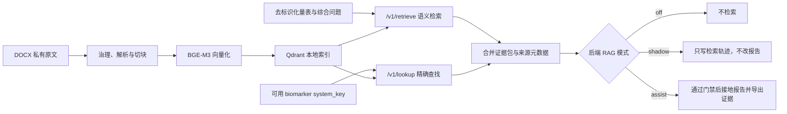

# RAG 第三步：受控报告接地与 Shadow 验证

本阶段把 BGE-M3 + Qdrant 检索封装为只监听本机的独立服务，并为报告链路增加受控接入。总体辅助证据使用语义检索，26 项固定 biomarker 使用 `system_key` 精确查找；两条路径共享治理门禁、来源白名单和审计输出。

## 当前状态

- 知识源：最初的 `康复知识条目结构化整理.docx`，以及后续整理的结构化内部审阅 JSON。
- 试运行集合：35 个条目、35 个切块，保留 33 个来源及原文件 SHA-256；当前仍为 0 个 `clinical_ready`。
- 语义检索：70 个可回答问题实测 `Hit@1=1.0`、`Hit@3=1.0`、`MRR=1.0`；另有 12 个无答案/对抗问题，暂未在稠密检索层评价拒答。
- 已知缺口：尚未加入 reranker、证据充分性判断和知识库无答案拒答器。
- 云端验收：稳定版本已完成真实数据包 Shadow 全链路；内部试运行完成真实 26 biomarker Assist 验收，精确查找 26/26 命中、逐项来源 26/26 对齐、旧通用解读 0 条。完整接地后 Qwen3-8B 报告生成由 156.97 秒降至 27.84 秒。

因此，生产基线仍使用 `shadow`。未审核知识的 `assist` 只允许按 [`RAG_TRIAL_ASSIST.md`](RAG_TRIAL_ASSIST.md) 做有醒目警示、可快速回退的内部试运行，不代表临床上线。

## 数据流



`/v1/retrieve` 解决“这份评估的综合解读可能需要哪些知识”，结果受相似度和 Top-K 影响；`/v1/lookup` 解决“这个固定指标必须使用哪一条已治理知识”，按唯一键返回，不做语义猜测。RAG 服务和报告后端使用不同 Python 环境。BGE-M3 固定在 CPU 上运行，避免占用报告大模型的 GPU 显存；Qdrant Local 同一时刻只由一个 RAG 服务进程打开。

## 三种模式

| 模式 | 是否检索 | 是否修改提示词/报告 | 用途 |
|---|---:|---:|---|
| `off` | 否 | 否 | 默认生产状态与快速回退 |
| `shadow` | 是 | 否 | 记录命中、延迟、来源和错误，验证工程与检索质量 |
| `assist` | 是 | 满足门禁时才会 | 经审核后的知识增强，或带未审核警示的隔离内部试运行 |

`assist` 有两道硬门禁：`RAG_MODE=assist` 且 `RAG_ASSIST_APPROVED=1`。默认还会剔除所有 `clinical_ready=false` 的条目。Demo 知识进入提示词另有实验开关，但正式环境必须一直保持 `RAG_ALLOW_DEMO_IN_PROMPT=0`。

## 安全与可追溯约束

1. RAG HTTP 地址只接受 `localhost`，服务也只能绑定 `127.0.0.1`。
2. 检索查询不包含患者姓名、患者编号等直接标识，只包含量表结果、分期和可用指标名称。
3. 服务超时、索引损坏或轨迹写入失败时采取 fail-open：报告继续按原流程生成。
4. Shadow 轨迹不保存知识正文，只保存去标识化 `session_id` 关联键、查询、命中 ID、分数、来源哈希和治理状态；文件权限为 `0600`。
5. 知识正文在提示词中被视为不可信参考数据，正文里的命令性文字不得改变任务、格式、权限或安全边界。
6. Assist 输出必须声明非空 `rag_citations`；代码拒绝本次检索白名单之外的知识 ID，并只把实际引用条目渲染到“辅助知识证据来源”表。
7. 每个 `system_key` 在集合中必须唯一；重复键在入库阶段拒绝，缺失或无效键不会被静默替换成相似条目。
8. 完整精确接地时，Brunnstrom、FMA 和 MAS 数值前缀、逐项指标解读与引用由代码生成或校验；大模型只负责定性摘要和高层建议。
9. JSON 的 `knowledge_evidence` 与 PDF 的知识索引同步保存实际采用条目、审核状态、来源 ID 和去重参考文献。

## 云端目录

代码发布目录可替换，知识原文、运行数据、索引和轨迹必须放在稳定数据目录：

```text
/root/autodl-tmp/rehab_project/
├── current -> releases/<commit>
├── rag.env
├── rag_service.pid
├── rag_service.log
├── rag_traces/report_retrieval.jsonl
└── knowledge_base/
    ├── raw/
    ├── runtime/rehab_knowledge_demo_v0_1/
    ├── runtime/rehab_knowledge_trial_v0_2/
    └── vector_store/qdrant_local/
```

这些私有资料均不提交 Git。

## 首次部署

以下命令均在服务器执行：

```bash
BASE=/root/autodl-tmp/rehab_project
APP=$BASE/current
RAG_PY=/root/autodl-tmp/envs/rag_env/bin/python

$RAG_PY -m pip install -r $APP/requirements-rag.txt
mkdir -p $BASE/knowledge_base/raw \
  $BASE/knowledge_base/runtime/rehab_knowledge_demo_v0_1 \
  $BASE/knowledge_base/vector_store $BASE/rag_traces
cp $APP/rag/.env.example $BASE/rag.env
chmod 600 $BASE/rag.env
```

把私有 DOCX 放到 `$BASE/knowledge_base/raw/` 后，生成受治理的条目和切块：

```bash
$RAG_PY $APP/scripts/rag_prepare_knowledge.py \
  --input "$BASE/knowledge_base/raw/康复知识条目结构化整理.docx" \
  --config "$APP/knowledge_base/config/rehab_knowledge_demo_v0_1.json" \
  --output-dir "$BASE/knowledge_base/runtime/rehab_knowledge_demo_v0_1"

$RAG_PY $APP/scripts/rag_verify_knowledge.py \
  --knowledge-dir "$BASE/knowledge_base/runtime/rehab_knowledge_demo_v0_1"
```

当前条目尚未完成临床审核，建立 Demo 索引必须显式传入 `--allow-demo`。建立或替换 Qdrant Local 索引前，必须先停止 RAG 服务，避免两个进程同时打开同一目录：

```bash
test ! -f $BASE/rag_service.pid || kill "$(cat $BASE/rag_service.pid)" || true
rm -f $BASE/rag_service.pid

set -a
. $BASE/rag.env
set +a

$RAG_PY $APP/scripts/rag_index.py \
  --chunks "$BASE/knowledge_base/runtime/rehab_knowledge_demo_v0_1/chunks.jsonl" \
  --manifest-out "$BASE/knowledge_base/runtime/rehab_knowledge_demo_v0_1/index_manifest.json" \
  --allow-demo
```

## 启动 Shadow

当前 Demo 验证需要在 `$BASE/rag.env` 中设置：

```env
RAG_ENABLED=1
RAG_ALLOW_DEMO=1
RAG_SERVICE_HOST=127.0.0.1
RAG_SERVICE_PORT=8010
```

复制并启动独立服务：

```bash
cp $APP/start_rag_service.sh $BASE/start_rag_service.sh
chmod +x $BASE/start_rag_service.sh
bash $BASE/start_rag_service.sh
curl -f http://127.0.0.1:8010/health
```

然后在 `backend/.env` 设置：

```env
RAG_MODE=shadow
RAG_SERVICE_URL=http://127.0.0.1:8010
RAG_SHADOW_INCLUDE_DEMO=1
RAG_ASSIST_APPROVED=0
RAG_ALLOW_DEMO_IN_PROMPT=0
RAG_TRACE_ENABLED=1
RAG_TRACE_PATH=/root/autodl-tmp/rehab_project/rag_traces/report_retrieval.jsonl
```

重启后端并完成一份评估。验收标准：报告 JSON、PDF 和网页内容与 `off` 模式一致；轨迹文件新增一行；RAG 服务停止时报告仍能正常完成。

```bash
tail -n 1 $BASE/rag_traces/report_retrieval.jsonl
curl -f http://127.0.0.1:8000/api/ready
```

快速回退只需把 `RAG_MODE=off` 后重启后端。即使 RAG 服务仍在运行，`off` 模式也不会发起检索。

## Assist 上线前门禁

满足以下条件前，不得把 `RAG_ASSIST_APPROVED` 改为 `1`：

1. 进入索引的条目均有可核验来源、版本、专家姓名和审核日期，并标记为 `clinical_ready=true`。
2. 建立至少 50 至 100 个经人工标注的检索问题，覆盖同义表达、错误前提、跨指标和知识库无答案。
3. 增加 reranker、证据充分性判断和明确拒答路径，并确定独立阈值评测方法。
4. 在固定病例集上对 `off` 与 `assist` 做盲评，确认事实一致性改善且没有处方越界。
5. 完成数据保护、临床责任边界、版本冻结和回滚演练。

当前版本完成了可部署的 Shadow 基座、精确 biomarker 接地和受门禁保护的内部 Assist 试运行，但不代表 RAG 已具备临床决策资格。云端试运行知识仍为 `clinical_ready=false`、`expert_verified=false`。

结构化审阅 JSON 的转换、82 题评测、隔离 Assist 冒烟和回退流程见 [`RAG_TRIAL_ASSIST.md`](RAG_TRIAL_ASSIST.md)。
